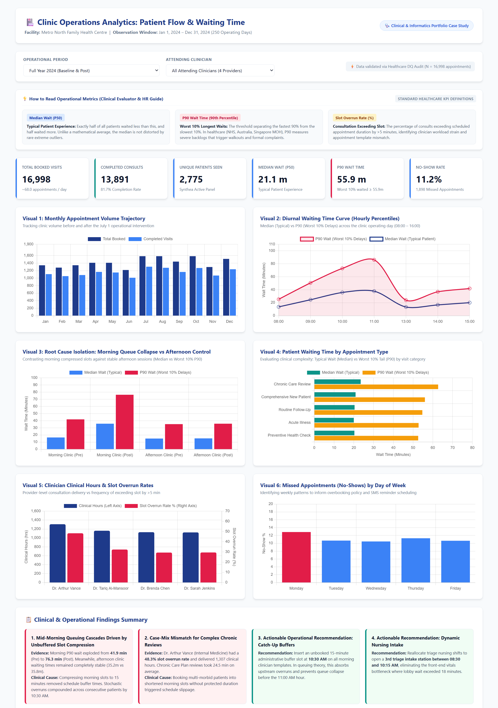
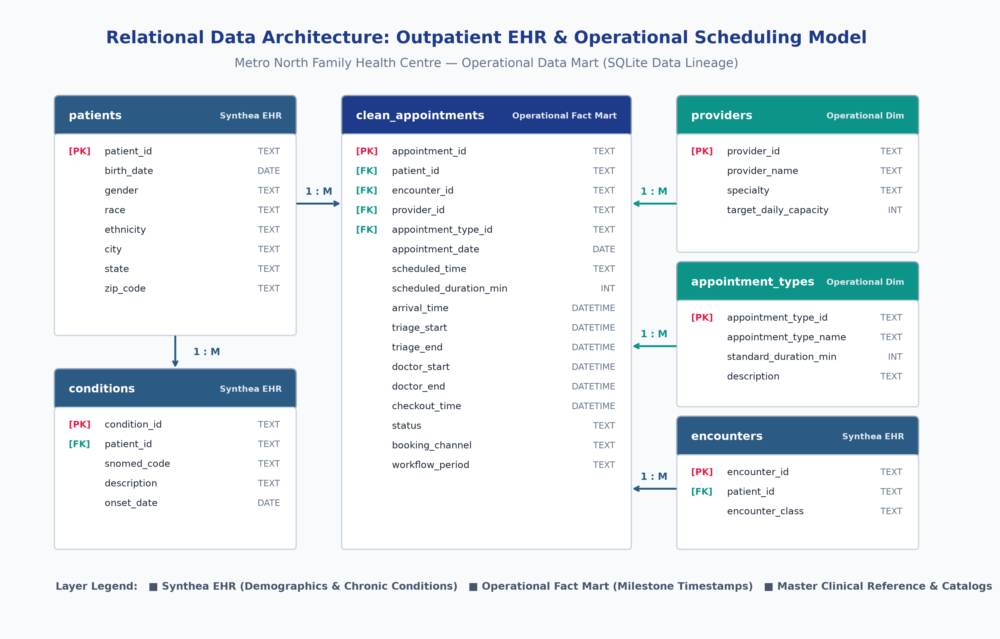

# Clinic Operations Analytics: Investigating Patient Flow, Waiting Time and Provider Workload

[](https://github.com)
[](https://github.com)
[](https://github.com)
[](docs/data_quality_report.md)

An end-to-end clinical operations and healthcare analytics case study investigating outpatient queuing dynamics, appointment template scheduling, and physician workload at **Metro North Family Health Centre (MN-FHC)**.

---

## 🖥️ Live Interactive Dashboard & Visual Preview

Explore the fully interactive, responsive operational dashboard with dynamic filters for operational period and attending clinician:

**▶ [Open Interactive Clinic Operations Dashboard](dashboard/index.html)** *(Open directly in any modern web browser)*



---

## ⚡ Recruiter Quick Path (The 60-Second Summary)

* **The Business Problem:** Following a mid-year scheduling change ("Morning Access Expansion" compressing morning slots to 15 min), Metro North Family Health Centre experienced an operational crisis: patient complaints doubled, mid-morning waiting lobbies overcrowded, and physicians routinely finished 45 minutes behind schedule. Management assumed overall volume had outgrown clinic physical capacity.
* **The Clinical Data Discovery:** Quasi-experimental session segmentation disproved management's volume assumption. While overall booked volume rose only 12.5%, **morning 90th-percentile (P90) wait times surged by 82% (from 41.9 min to 76.3 min)**. Crucially, **afternoon clinics remained completely stable (35.2 min vs 35.8 min)** across the exact same providers and rooms.
* **The Root Cause:** Compressing morning slots to 15 minutes eliminated schedule buffer time. When complex multi-morbid patients (`Chronic Disease Care Plan Reviews` taking 24.5 min on average) were booked into shortened morning slots, physician overruns cascaded downstream, creating exponential queue delays by 10:30 AM.
* **The Operational Fix:** Rather than hiring more staff or expanding clinic hours, clinic flow can be restored by **reinstating 30-minute protected slots for chronic visits**, inserting an **unbooked 15-minute administrative catch-up buffer at 10:30 AM**, and **adding a 3rd triage intake station during morning peak arrival windows**.

---

## 🩺 My Role: Clinical & Informatics Perspective

> *"As an MBBS clinician with Medical Software Coordinator experience, I bridge the gap between bedside clinical workflows and healthcare data architecture. I have worked directly with clinicians on EHR requirements, workflow optimization, user acceptance testing (UAT), and system implementation."*

In this portfolio project, clinical domain knowledge shaped every stage of the analytical pipeline:
1. **Clinical Workflow Grounding:** Recognizing that outpatient delays are not random bell curves, but rather discrete-event queues where upstream milestone stamps (`arrival_time` $\rightarrow$ `triage_start` $\rightarrow$ `doctor_start` $\rightarrow$ `checkout`) reveal the exact physical location of operational choke points.
2. **EHR Data Governance:** Enforcing authentic enterprise EHR architecture—linking completed visits to billed clinical encounters (`encounters`), while ensuring missed appointments (`NO_SHOW`, `CANCELLED`) carry `encounter_id = NULL`.
3. **Statistical Skepticism:** Rejecting arithmetic averages in favor of **Median (P50), P75, and P90 percentiles**, recognizing that right-skewed tails represent the vulnerable patients experiencing unacceptable delays.
4. **Actionable Operations:** Delivering realistic, low-cost operational interventions (schedule template design, catch-up buffers, and nurse shift reallocations) rather than unrealistic multi-million-dollar technology proposals.

---

## 🎯 Analytical Framework & Key Business Questions

The study was structured into 6 analytical domains:

| Domain | Core Business Question | Key Operational Metric |
| :--- | :--- | :--- |
| **1. Volume & Utilization** | How did clinic appointment volume fluctuate across 2024? | Total Booked, Completed Visits, Show Rate (%) |
| **2. Appointment Mix** | What appointment types dominate the schedule across providers? | Distribution by Appointment Type |
| **3. Missed Appointments** | Where are missed appointments concentrated (day, type, age cohort)? | No-Show Rate (%), Cancellation Rate (%) |
| **4. Patient Waiting Time** | What are the typical (P50) and extreme (P90) patient delays? | `total_clinical_wait` (Arrival $\rightarrow$ Doctor Start) |
| **5. Provider Workload** | Which clinicians face the heaviest burden and slot overrun rates? | Clinical Hours, Slot Overrun Rate (>5 min over slot) |
| **6. Before vs After Impact** | What was the true root cause of the wait time deterioration? | Pre vs Post Session Segmentation (Morning vs Afternoon) |

> [!NOTE]
> **Clinical & Evaluator Primer: Why P90 Matters (Instead of Simple Averages)**
> * **Median (P50):** The *typical* patient wait (50% waited less, 50% waited more). Robust against outliers.
> * **P90 (90th Percentile):** The delay threshold for the **worst 10% of patients** (90% were seen faster, but the unhappiest 10% waited longer than this cutoff). In international healthcare quality frameworks (UK NHS, Australian Health Boards, Singapore MOH), P90 is the gold standard KPI because simple arithmetic averages conceal the extreme backlogs that trigger clinic walkouts, delayed diagnoses, and patient complaints.

---

## 📊 Key Findings

```text
┌────────────────────────────────────────────────────────────────────────────────────────┐
│ SUMMARY OF EMPIRICAL FINDINGS (N = 16,998 Scheduled Visits, 250 Operating Days)        │
├────────────────────────────────────────────────────────────────────────────────────────┤
│ • Total Booked Visits:       16,998 visits (Pre: 7,998  |  Post: 9,000)                │
│ • Completed Consultations:   13,891 visits (81.7% Show Rate)                           │
│ • Overall No-Show Rate:       11.2% (1,898 missed appointments)                         │
│ • Unique Patients Seen:       2,775 active panel patients                              │
│ • Baseline P90 Wait Time:     39.2 minutes (Pre-Intervention)                          │
│ • Post-Intervention P90:      68.0 minutes overall (Peak Morning: 76.3 minutes)        │
└────────────────────────────────────────────────────────────────────────────────────────┘
```

### Finding 1: Mid-Morning Queuing Cascades Driven by Unbuffered Slot Compression
* **Evidence:** Morning P90 wait times jumped from **41.9 min** (Pre) to **76.3 min** (Post)—an 82% surge. Meanwhile, afternoon clinics (which maintained standard 20-min spacing throughout the year) remained flat at **35.2 min** (Pre) vs **35.8 min** (Post).
* **Operational Interpretation:** Total volume only grew 12.5%, which cannot explain the delay. Compressing morning slots to 15 minutes eliminated schedule buffers. By Little’s Law, as utilization approaches 100% without buffers, minor consultation overruns compound exponentially across consecutive appointments.
* **Recommendation:** Abolish uniform 15-minute morning compression and insert an unbooked 15-minute administrative catch-up buffer at **10:30 AM** on all provider templates.

### Finding 2: Case-Mix Complexity Mismatch for Chronic Care Consultations
* **Evidence:** `Chronic Disease Care Plan Reviews` averaged **24.5 minutes** of face-to-face physician time. Dr. Arthur Vance (Internal Medicine, geriatric focus) delivered 1,307 clinical hours and had a **48.3% slot overrun rate** (averaging +4.1 min over scheduled slot).
* **Operational Interpretation:** To accommodate patient preferences during the mid-year Chronic Care Campaign, front-desk staff booked complex multi-morbid reviews into compressed 15-minute morning slots without expanding slot duration.
* **Recommendation:** Enforce EHR scheduling decision-support hard stops that prevent chronic care reviews and comprehensive new patient intakes from being booked in slots shorter than 30 minutes.

### Finding 3: Front-End Nursing Intake Choke Point During Peak Check-Ins
* **Evidence:** Lobby wait prior to nursing vitals (`triage_wait_min`) increased from **4.5 min** (Pre) to **8.6 min** (Post), with peak morning triage waits exceeding **18 minutes**.
* **Operational Interpretation:** Dense 15-minute arrival spacing overwhelmed the 2-nurse triage capacity between 08:30 and 10:00 AM, holding patients in the lobby even when exam rooms were temporarily vacant.
* **Recommendation:** Stagger nursing shift rosters to staff **3 triage stations between 08:30 and 10:15 AM**, eliminating the front-end intake bottleneck.

### Finding 4: Monday No-Show Concentration with Minimal Access Benefit
* **Evidence:** No-show rates peaked on Mondays at **12.88%** (compared to 10.48% on Wednesdays), and routine follow-ups exhibited the highest no-show frequency (12.18%). The slot compression policy did not reduce no-show rates (10.85% Pre vs 11.44% Post).
* **Operational Interpretation:** Compressing slots to "hedge" against no-shows failed: on days when attendance was high, it triggered severe congestion.
* **Recommendation:** Implement automated 48-hour SMS confirmation prompts with dedicated follow-up for high-risk cohorts (young adults 18–39, Monday morning appointments).

---

## 🛠️ Tools & Technologies

| Tool / Technology | Purpose & Implementation |
| :--- | :--- |
| **SQL (SQLite 3)** | DDL schema creation, relational integrity, analytical CTEs, `NTILE` percentile approximation, diurnal aggregations, and window functions |
| **Python 3.12 & Pandas** | Data loading, discrete-event queuing simulation, feature engineering, and statistical hypothesis testing |
| **Matplotlib & Seaborn** | Publication-ready clinical visualizations, percentile curves, and executive dashboard preview generation |
| **Jupyter Notebook** | Interactive end-to-end case study walk-through with clinical annotations |
| **HTML5 / CSS3 / Chart.js** | Standalone interactive operational dashboard with real-time dynamic filtering |
| **MITRE Synthea™** | Standardized synthetic EHR population baseline (Demographics & SNOMED-CT Problem Lists) |

---

## 🗄️ Relational Data Architecture & ER Diagram

The database architecture mirrors enterprise hospital data models, cleanly separating the **Synthea EHR Master Patient Index** from the **Operational Scheduling Fact Table**:



*For detailed field-level definitions, constraints, and derived duration formulas, see the [Full Data Dictionary](docs/data_dictionary.md).*

---

## 🔍 Healthcare Data Quality (DQ) Audit

In real-world healthcare analytics, data is rarely clean. A structured DQ audit pipeline (`sql/data_quality.sql` & `src/data_quality.py`) was executed prior to analytical modeling:

| Check ID | Validation Domain | Rule / Integrity Condition | Issues Found | Clinical / Operational Risk | Resolution Action |
| :---: | :--- | :--- | :---: | :--- | :--- |
| **DQ-01** | Uniqueness (PK) | `Unique appointment_id` | **4** | Artificially inflates visit volumes. | Deduplicated; first record retained. |
| **DQ-02** | Milestone Completeness | `arrival_time NOT NULL when status='COMPLETED'` | **6** | Kiosk bypass; cannot measure waiting time. | Flagged kiosk bypass; excluded from wait cohort. |
| **DQ-03** | Temporal Order | `doctor_start >= arrival_time` | **3** | Tablet clock desync; creates negative wait times. | Logged time-sync fault; excluded corrupted records. |
| **DQ-04** | Temporal Order | `checkout_time >= doctor_end` | **3** | Premature front-desk discharge entry. | Excluded from Total Length of Stay (LOS). |
| **DQ-05** | Referential Integrity | `provider_id in providers table` | **2** | Test provider (`PRV-999`) on active schedule. | Excluded from provider benchmarks. |

* **Raw Records Audited:** 17,004
* **Clean Records Retained:** 16,998 (99.96% Retention Rate)
* *For the full governance review, see the [Data Quality Audit Report](docs/data_quality_report.md).*

---

## 💻 SQL Analysis Catalog

The project includes 6 modular, production-ready SQL analysis scripts (`sql/`):

1. **[`01_volume_analysis.sql`](sql/01_volume_analysis.sql):** Clinic volume summary, completion rates, monthly trajectory, and weekday load.
2. **[`02_scheduling_patterns.sql`](sql/02_scheduling_patterns.sql):** Appointment type distribution, provider caseload breakdown, and hourly slot density.
3. **[`03_no_show_analysis.sql`](sql/03_no_show_analysis.sql):** Missed appointments by visit type, weekday patterns, and Synthea patient age cohort cross-tabulation.
4. **[`04_waiting_time_analysis.sql`](sql/04_waiting_time_analysis.sql):** Milestone interval averages, `NTILE(100)` percentile distributions (P50/P75/P90), diurnal hourly curve, and wait by visit type.
5. **[`05_provider_workload.sql`](sql/05_provider_workload.sql):** Provider clinical hours delivered, average slot variance, slot overrun rates (>5 min over slot), and provider-level wait times.
6. **[`06_before_after_intervention.sql`](sql/06_before_after_intervention.sql):** Quasi-experimental KPI comparison Pre vs Post, session segmentation (Morning vs Afternoon control), and case-mix shift.

*All queries can be executed in one command via `python src/run_sql_analysis.py`.*

---

## 📈 Python & Queuing Analysis Highlights

The Python analysis (`src/analysis.py` & [`notebooks/clinic_operations_analysis.ipynb`](notebooks/clinic_operations_analysis.ipynb)) tested 4 competing hypotheses to rigorously explain why waiting times escalated:

```python
# Segmenting waiting times by session and operational era in Pandas:
session_comp = df_valid.groupby(['workflow_period', 'clinic_session'])['total_clinical_wait_min'].agg(
    completed_visits='count',
    median_wait='median',
    p90_wait=lambda x: np.percentile(x, 90)
)
```

### Result:
* **Afternoon Clinics:** Pre P90 = **35.2m** vs Post P90 = **35.8m** *(Stable Control Group)*
* **Morning Clinics:** Pre P90 = **41.9m** vs Post P90 = **76.3m** *(Severe Queuing Collapse)*

```text
The Diurnal Waiting Time Curve demonstrates queue build-up throughout the morning:
08:00 AM ───▶ Median: 13.6m  |  P90: 25.4m   (Clinic starts on time)
09:00 AM ───▶ Median: 24.6m  |  P90: 50.7m   (Slight overruns accumulate)
10:00 AM ───▶ Median: 36.0m  |  P90: 72.9m   (Peak congestion window)
11:00 AM ───▶ Median: 38.4m  |  P90: 86.3m   (Severe queue cascade)
12:30 PM ───▶ [1-Hour Protected Lunch Break: QUEUE RESETS]
01:00 PM ───▶ Median: 13.6m  |  P90: 24.4m   (Afternoon restarts on time)
```

---

## 📁 Repository Structure

```text
clinic-operations-analytics/
├── data/
│   ├── raw/
│   │   ├── synthea/                 # Synthea EHR foundation (patients, conditions, encounters)
│   │   └── operational/             # Synthetic clinic operational fact & reference tables
│   ├── processed/
│   │   ├── clean_appointments.csv   # Post-audit cleaned operational dataset (N = 16,998)
│   │   └── summary_metrics.json     # Aggregated operational KPIs
│   └── clinic_operations.db         # Standalone SQLite 3 database
│
├── sql/
│   ├── schema.sql                   # Relational DDL with PK/FK constraints & analytical indexes
│   ├── data_quality.sql             # SQL validation audit suite
│   ├── 01_volume_analysis.sql       # Volume & patient reach queries
│   ├── 02_scheduling_patterns.sql   # Appointment type & hourly density queries
│   ├── 03_no_show_analysis.sql      # Missed appointment & demographic queries
│   ├── 04_waiting_time_analysis.sql # Milestone durations & NTILE percentile queries
│   ├── 05_provider_workload.sql     # Provider hours & slot overrun queries
│   └── 06_before_after_intervention.sql # Quasi-experimental Pre vs Post evaluation
│
├── src/
│   ├── generate_synthea_data.py     # Synthea patient cohort generator (2,800 patients)
│   ├── generate_operational_data.py # Outpatient queuing simulation engine (17,000 visits)
│   ├── load_to_sqlite.py            # SQLite schema executor & CSV ingestion pipeline
│   ├── data_quality.py              # Healthcare DQ audit pipeline & cleaner
│   ├── run_sql_analysis.py          # Automated SQL query execution runner
│   ├── analysis.py                  # Python statistical modeling & figure generation
│   ├── create_notebook.py           # Automated Jupyter Notebook generator
│   ├── generate_dashboard_data.py   # Multi-slice JSON builder & reactive engine
│   ├── capture_dashboard_screenshot.py # Selenium headless browser screenshot tool
│   ├── generate_presentation.py     # Executive 11-slide PowerPoint briefing generator
│   └── generate_er_diagram.py       # High-resolution ER Diagram renderer
│
├── notebooks/
│   └── clinic_operations_analysis.ipynb # Interactive executive analysis notebook
│
├── dashboard/
│   ├── index.html                   # Interactive web dashboard (HTML5 / CSS3 / Chart.js)
│   └── dashboard_preview.png        # High-resolution dashboard preview graphic
│
├── docs/
│   ├── presentation/
│   │   └── clinic_operations_executive_briefing.pptx # Executive 11-slide briefing deck
│   ├── data_dictionary.md           # Field definitions, constraints & duration formulas
│   ├── data_quality_report.md       # Formal healthcare DQ audit report
│   ├── methodology.md               # Analytical methodology & queuing framework
│   ├── data_model.png               # High-resolution Entity-Relationship Diagram
│   └── images/                      # Publication figures (Fig 1 to Fig 5)
│
├── .streamlit/
│   └── config.toml                  # Streamlit production theme & UI configuration
├── streamlit_app.py                 # Streamlit Community Cloud interactive web app
├── app.py                           # Zero-configuration entry point alias
├── requirements.txt                 # Python library dependencies (pandas, plotly, streamlit, etc.)
└── README.md                        # Portfolio case study documentation
```

---

## ⚖️ Synthetic Data Disclaimer

> **Data Attribution Notice:** Clinical and demographic variables in this project were generated using the open-source MITRE Synthea™ patient simulation framework. Clinic operational scheduling, milestone timestamps, provider templates, and queuing dynamics were independently synthesized for this healthcare operations portfolio project. No real patient data, protected health information (PHI), or actual clinical records were used.

---

## ☁️ Deploy to Streamlit Community Cloud (share.streamlit.io)

This application is 100% pre-configured for one-click deployment on **[Streamlit Community Cloud](https://share.streamlit.io/)**:

1. **Push this repository to your GitHub account.**
2. Log in to [share.streamlit.io](https://share.streamlit.io/) using your GitHub account.
3. Click **"New app"**.
4. Configure the deployment settings:
   - **Repository:** `AungChitMoe1995/clinic-operations-analytics`
   - **Branch:** `main`
   - **Main file path:** `streamlit_app.py` *(or `app.py`)*
5. Click **"Deploy!"**
   - The app will automatically install dependencies from `requirements.txt`, load cached operational data slices, and launch with full interactive filtering, SBAR governance briefing, Plotly charts, and CSV downloads.

---

## 🚀 How to Run the Project Locally

### 1. Prerequisites
Ensure **Python 3.10+** and **Git** are installed.

### 2. Clone the Repository & Install Dependencies
```bash
git clone https://github.com/AungChitMoe1995/clinic-operations-analytics.git
cd clinic-operations-analytics
pip install -r requirements.txt
```

### 3. Generate Data & Build the SQLite Database
```bash
# Generate Synthea demographics and operational queuing records
python src/generate_synthea_data.py
python src/generate_operational_data.py

# Ingest into SQLite database
python src/load_to_sqlite.py

# Run healthcare Data Quality audit and produce clean analytical tables
python src/data_quality.py
```

### 4. Run Analysis & Visualizations
```bash
# Execute the complete SQL analysis suite
python src/run_sql_analysis.py

# Run Python statistical modeling and generate figures
python src/analysis.py
```

### 5. Launch the Web Applications
```bash
# Option A: Launch the Streamlit Cloud Application locally
streamlit run streamlit_app.py

# Option B: Open the standalone HTML5 dashboard in any browser
# Open dashboard/index.html
```
